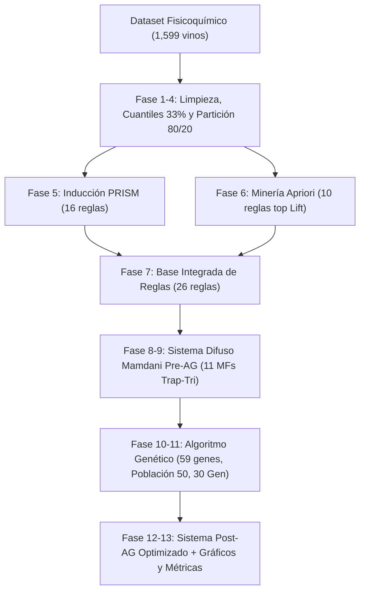

# Sistema Híbrido de Clasificación de Calidad de Vinos
## Minería de Reglas (PRISM + Apriori), Lógica Difusa Mamdani y Optimización con Algoritmos Genéticos (DEAP)


---

## 1. Descripción del Proyecto y Sustentación Académica

Este proyecto implementa un **sistema híbrido de inteligencia artificial interpretable** para la clasificación de calidad de vinos tintos (*Wine Quality Dataset - UCI Machine Learning Repository*). 

A diferencia de los modelos de "caja negra" contemporáneos (e.g., redes neuronales profundas o ensambles tipo XGBoost), esta arquitectura prioriza la **transparencia cognoscitiva, interpretabilidad semántica y optimización matemática rigurosa**, construyendo un pipeline sin algoritmos externos de machine learning tradicionales.

### El flujo se estructura en 3 Fases Progresivas de Evolución:
1. **Fase 1 (Modelo Base Discreto):** Extracción de conocimiento inductivo (algoritmo **PRISM** desde cero) y asociativo (algoritmo **Apriori** desde cero), discretizados por cuantiles empíricos (Equal-Frequency 33%).
2. **Fase 2 (Sistema Difuso Canónico - Pre-AG):** Fuzzificación de las 11 variables fisicoquímicas continuas mediante funciones de pertenencia híbridas (Trapezoidal-Triangular) y motor de inferencia difusa **Mamdani con defuzzificación por Centroide cuantitativo (COG)**.
3. **Fase 3 (Sistema Difuso Optimizado - Post-AG):** Calibración evolutiva simultánea mediante un **Algoritmo Genético (DEAP / NumPy)** que afina los puntos de corte de las funciones de pertenencia y modula/poda la base de reglas mediante un cromosoma mixto de 59 genes.



---

## 2. Fundamentación Teórica de los Algoritmos

### 2.1. Algoritmo PRISM (Cendrowska, 1987) — Implementado desde cero
PRISM es un algoritmo inductivo de "separar y conquistar" diseñado para extraer reglas modulares $\text{SI } A \text{ ENTONCES } B$ sin generar la complejidad innecesaria de árboles de decisión estructurados (ID3/C4.5).
* **Función de Selección:** En cada paso selecciona el término $A_i = v_{ij}$ que maximiza la probabilidad condicional $p(C | A_i)$:
  $$p(C | A_i) = \frac{\text{Conteo}(C \cap A_i)}{\text{Conteo}(A_i)}$$
* **Modularidad:** Genera reglas independientes por clase, eliminando los antecedentes redundantes.

### 2.2. Algoritmo Apriori (Agrawal & Srikant, 1994) — Implementado desde cero
Explora el espacio de transacciones buscando co-ocurrencias entre características fisicoquímicas y la calidad del vino.
* **Filtros Estrictos Aplicados:** Soporte $\ge 0.02$, Confianza $\ge 0.60$, Lift $> 1.20$.
* **Lift Condicional:** Mide la fuerza de correlación real:
  $$\text{Lift}(A \rightarrow B) = \frac{P(A \cap B)}{P(A) \cdot P(B)}$$

### 2.3. Lógica Difusa Mamdani con Defuzzificación por Centroide
Supera la rigidez de los límites discretos mediante grados continuos de pertenencia $\mu(x) \in [0.0, 1.0]$.
* **Funciones Híbridas Trapezoidales-Triangulares:**
  * `Bajo`: Trapezoidal con hombro izquierdo abierto ($\mu=1.0$ en $x \le a$).
  * `Medio`: Triangular centrada en $b$.
  * `Alto`: Trapezoidal con hombro derecho abierto ($\mu=1.0$ en $x \ge c$).
* **Fuerza de Disparo de Regla $\alpha_k$:**
  $$\alpha_k = w_k \cdot \min_{(v, l) \in \text{Antecedentes}} \mu_{v, l}(x)$$
* **Defuzzificación por Centroide Cuantitativo (COG):**
  $$z^* = \frac{\int z \cdot \mu_{\text{salida}}(z) \, dz}{\int \mu_{\text{salida}}(z) \, dz}$$

### 2.4. Algoritmo Genético con Cromosoma Mixto (DEAP / NumPy)
Optimiza simultáneamente la geometría de los conjuntos difusos y la importancia de cada regla.
* **Cromosoma Mixto de 59 Genes:**
  * **Genes 0..32 (33 floats):** 11 variables $\times$ 3 puntos de corte ($a_i, b_i, c_i$).
  * **Genes 33..58 (26 floats en $[0.0, 1.0]$):** Pesos $w_k$ de las 26 reglas.
* **Operador de Factibilidad Estricta:**
  Garantiza en todo momento que $\min_i \le a_i < b_i < c_i \le \max_i$.
* **Función de Aptitud (Fitness Multi-criterio):**
  $$\text{Fitness} = 0.70 \cdot \text{F1\_Macro} + 0.20 \cdot \text{Cobertura} - 0.10 \cdot \left(\frac{\text{Reglas\_Activas}}{\text{Reglas\_Totales}}\right)$$

---

## 3. Resultados Experimentales y Comparativa en 3 Fases

Evaluación sobre el conjunto independiente de prueba (**Test Set, N=320**, 20% estratificado):

| Métrica de Rendimiento | 1. Baseline Discreto (PRISM + Apriori) | 2. Pre-AG Difuso (Mamdani Canónico) | 3. Post-AG Difuso (Optimizado con AG) | Ganancia vs Baseline |
|---|:---:|:---:|:---:|:---:|
| **Exactitud Global (Accuracy)** | 57.50% | 55.94% | **60.31%** | **+2.81%** |
| **F1-Score Macro** | 0.4674 | 0.4804 | **0.5647** | **+9.73 pts** |
| **F1-Score Weighted** | 0.5236 | 0.5263 | **0.6059** | **+8.23 pts** |
| **Cobertura de Muestras** | 79.69% | 98.44% | **99.38%** | **+19.69 pts** |
| **Recall en Clase 'Alta'** | 11.63% (5/43) | 34.88% (15/43) | **44.19% (19/43)** | **+32.56 pts** |
| **Reglas Activas Utilizadas** | 26 (100%) | 26 (100%) | **16 (61.5% activas, 38.5% podadas)** | **Mayor Parsimonia** |

---

## 4. Estructura del Repositorio

```text
ProyectoGeneticosFuzzy/
├── results/
│   ├── historial_convergencia_ga.csv     # Métricas por generación del AG
│   ├── params_mfs_iniciales.json         # Puntos de corte iniciales (cuantiles)
│   ├── params_mfs_optimizadas_ga.json    # Puntos de corte óptimos hallados por el AG
│   ├── reglas_apriori.csv                # 1,031 reglas de asociación
│   ├── reglas_prism.csv                  # 16 reglas inductivas PRISM
│   ├── reglas_base_integrada.json        # 26 reglas unificadas iniciales
│   ├── reglas_optimizadas_ga.json        # Reglas con pesos y estados modulados por el AG
│   └── plots/                            # Figuras de alta resolución (300 DPI)
│       ├── convergencia_fitness_ga.png
│       ├── comparativa_mfs_pre_post_ga.png
│       ├── matrices_confusion_comparativas.png
│       └── evolucion_reglas.png
├── src/
│   ├── datos/                            # Carga y preparación del dataset
│   │   ├── carga/                        # Submódulo de carga y verificación
│   │   ├── preparacion/                  # Submódulo de cuantiles 33% y partición
│   │   └── datos.py                      # Ejecutor del flujo de datos
│   ├── prism/                            # Algoritmo PRISM desde cero
│   │   ├── induccion/                    # Submódulo voraz de selección de términos
│   │   ├── reglas/                       # Dataclass y evaluación de ReglaPRISM
│   │   └── prism.py                      # Ejecutor del algoritmo PRISM
│   ├── apriori/                          # Algoritmo Apriori desde cero
│   │   ├── itemsets/                     # Generación Ck, soporte y poda Lk
│   │   ├── reglas/                       # Reglas de asociación y filtro estricto
│   │   └── apriori.py                    # Ejecutor del algoritmo Apriori
│   ├── reglas/                           # Integración y Clasificador Base
│   │   ├── integracion/                  # Fusión PRISM+Apriori y deduplicación
│   │   ├── clasificador_base/            # Clasificador Discreto (Baseline Fase 1)
│   │   ├── regla_unificada.py            # Dataclass ReglaUnificada
│   │   └── reglas.py                     # Ejecutor de integración de reglas
│   ├── fuzzy/                            # Lógica Difusa Mamdani
│   │   ├── pertenencia/                  # Funciones Trapezoidal/Triangular y MFs
│   │   ├── inferencia/                   # Implicación MIN y Agregación MAX
│   │   ├── defuzzificacion/              # Centroide continuo y umbrales
│   │   └── fuzzy.py                      # Ejecutor del motor difuso Mamdani
│   ├── genetico/                         # Algoritmo Genético (DEAP / NumPy)
│   │   ├── cromosoma/                    # Estructura 59 genes y reparación a<b<c
│   │   ├── poblacion/                    # Semilla canónica y perturbación
│   │   ├── cruce/                        # Cruce híbrido (SBX + Uniforme)
│   │   ├── mutacion/                     # Mutación gaussiana acotada + pesos
│   │   ├── fitness/                      # Evaluación de aptitud multi-criterio
│   │   └── genetico.py                   # Ejecutor del AG (Runner sin subcarpeta)
│   ├── evaluacion/                       # Evaluación comparativa progresiva
│   │   ├── metricas/                     # Accuracy, F1 Macro/Weighted, Cobertura
│   │   ├── comparacion/                  # Benchmark 3 Fases (Baseline, Pre, Post)
│   │   └── evaluacion.py                 # Ejecutor de evaluación comparativa
│   ├── visualizacion/                    # Generación automatizada de gráficos
│   │   ├── graficos/                     # Módulos para convergencia, MFs, matrices
│   │   └── visualizacion.py              # Ejecutor de generación de figuras
│   ├── web/                              # Plantillas y recursos del dashboard
│   │   └── templates/index.html          # Interfaz web en tema Zinc/Slate oscuro
│   ├── app_web.py                        # Servidor Flask para visualización XAI
│   └── main.py                           # Pipeline maestro de orquestación CLI
├── wine+quality/                         # Dataset oficial UCI
├── PROGRESS.md                           # Bitácora detallada de las 13 fases (100%)
└── README.md                             # Documentación técnica completa
```

---

## 5. Instrucciones de Instalación y Ejecución

### 5.1. Requisitos Previos
Instalar las librerías necesarias con Python 3.10+:
```bash
pip install numpy pandas scikit-learn scikit-fuzzy deap matplotlib
```

### 5.2. Aplicación Web Interactiva (Dashboard XAI en Vivo)
Para iniciar la interfaz gráfica interactiva con simulador en tiempo real:
```bash
python src/app_web.py
```
Abre en tu navegador: **`http://127.0.0.1:5000`**

### 5.3. Ejecución de Punta a Punta (Pipeline Maestro CLI)
Para ejecutar todo el flujo (Fases 1 a 13) usando los resultados optimizados del AG:
```bash
python src/main.py --skip-ga
```

Para re-entrenar el Algoritmo Genético desde cero durante 30 generaciones:
```bash
python src/main.py --all --generaciones 30 --poblacion 50
```

### 5.3. Ejecución Modular de Fases Individuales
```bash
# Fase 5: Inducción de Reglas con PRISM
python src/main.py --fase prism

# Fase 6: Minería de Reglas con Apriori
python src/main.py --fase apriori

# Fase 7: Integración y Evaluación Baseline Discreto
python src/main.py --fase reglas

# Fase 8-9: Inferencia Difusa Mamdani Pre-AG
python src/main.py --fase fuzzy

# Fase 10-11: Optimización con Algoritmo Genético
python src/main.py --fase genetico

# Fase 12: Evaluación Comparativa en 3 Fases
python src/main.py --fase evaluacion

# Fase 13: Generación de Gráficos
python src/visualizacion.py
```

---

## 6. Galería de Visualizaciones Generadas

Los gráficos generados se guardan automáticamente en `results/plots/`:
1. **`convergencia_fitness_ga.png`**: Evolución del fitness máximo y promedio, F1-Macro, cobertura y reducción de reglas activas a lo largo de las 30 generaciones.
2. **`comparativa_mfs_pre_post_ga.png`**: Comparación de las funciones de pertenencia iniciales (Pre-AG) vs optimizadas (Post-AG) para las variables clave (`alcohol`, `volatile acidity`, `sulphates`, `citric acid`, `total sulfur dioxide`, `pH`).
3. **`matrices_confusion_comparativas.png`**: Matrices de confusión lado a lado evaluadas en el conjunto de prueba (Test, N=320) para Baseline Discreto, Pre-AG y Post-AG.
4. **`evolucion_reglas.png`**: Distribución de pesos $w_k$, poda del 38.5% de reglas redundantes y síntesis semántica de reglas líderes.
